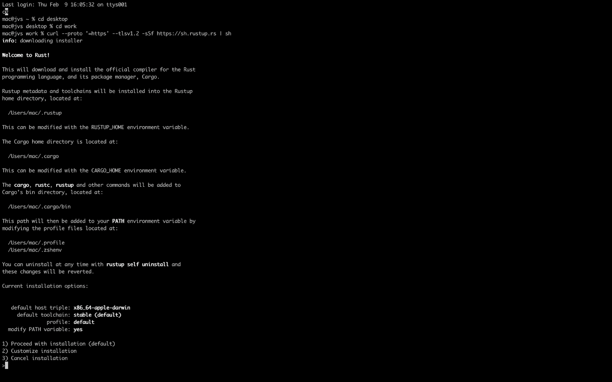
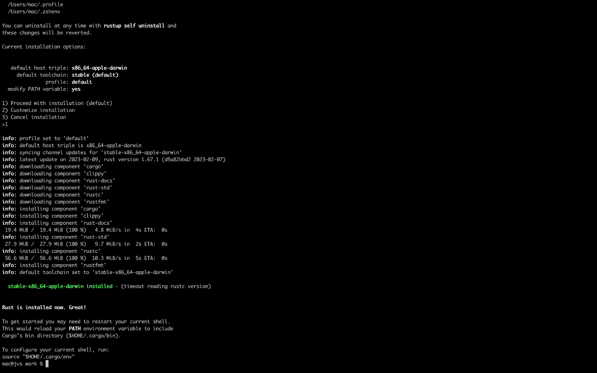
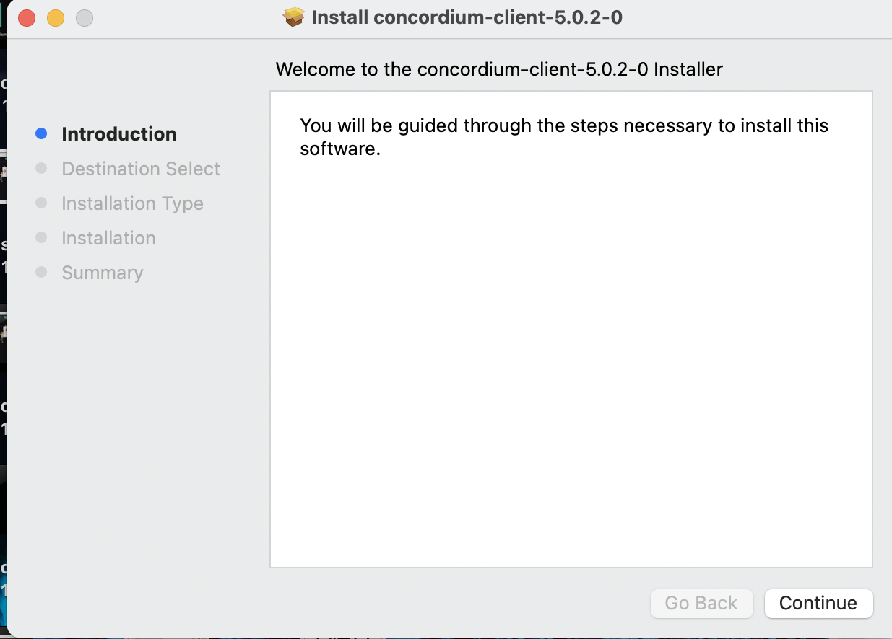
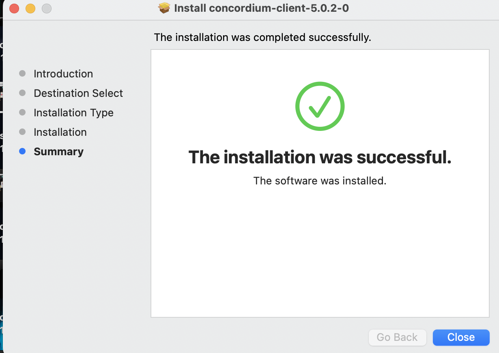
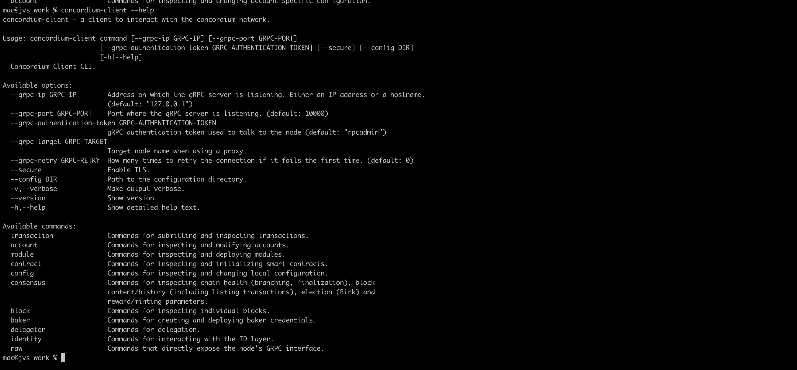
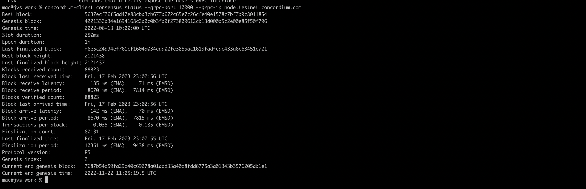
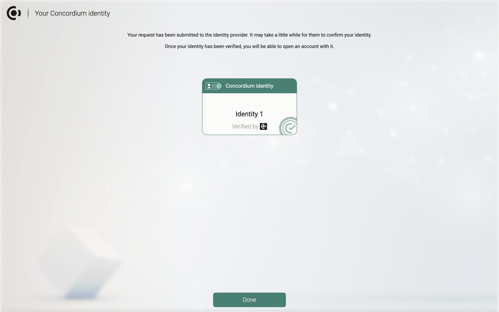
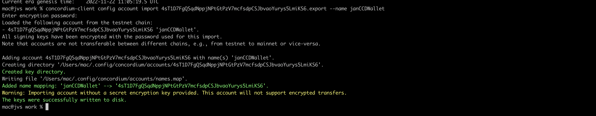

# ccd-task-1
STEPS TO INSTALL
The first step is to install rust using rustup this website https://rustup.rs/
I ran this command 
curl --proto '=https' --tlsv1.2 -sSf https://sh.rustup.rs | sh
This was the output

I then inputted 1 to proceed with the installation
Rust has been installed successfully 

Next I i ran source "$HOME/.cargo/env" to restart my current shell and then I 
Installed wasm which will be used for building contracts using “rust-std' for 'wasm32-unknown-unknown” 

Now we install Concordium software package, I downloaded Cargo-concordium v2.7.0, from this website https://developer.concordium.software/en/mainnet/net/installation/downloads-testnet.html#cargo-concordium-v2-7-0, I renamed the cargo-concordium-v.x.x file to cargo-concordium
I added the current configuration to the path by running % chmod +x /Users/mac/Downloads/cargo-concordium

Now we install concordium-client, we download the pkg file from https://developer.concordium.software/en/mainnet/net/installation/downloads-testnet.html#concordium-node-and-client-download-testnet,

Now I connect to the concordium-client public node by running concordium-client consensus status --grpc-port 10000 --grpc-ip node.testnet.concordium.com

The next step is to set up a wallet using the Concordium Wallet for We, the extension was downloaded and installed, now we create an identity

Now you export keys, after that you will import your key into the concordium-client configuration

